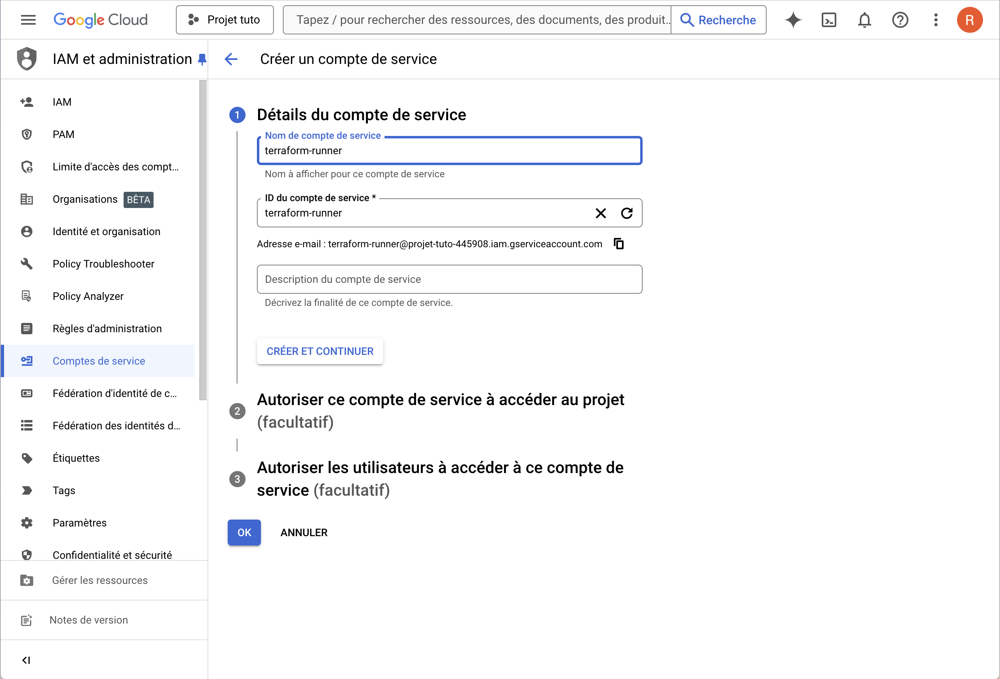

# Simple Pipeline Using GCP

Ce projet est un tutoriel démontrant comment créer une pipeline de données en utilisant Docker, Airflow, Terraform et Google Cloud Platform (GCP). L'objectif est de fournir une introduction pratique à la création de pipelines de données sur GCP.

## Table des matières

- [Aperçu](#aperçu)
- [Prérequis](#prérequis)
- [Architecture](#architecture)
- [Installation](#installation)
- [Utilisation](#utilisation)
- [Nettoyage](#nettoyage)
- [Ressources supplémentaires](#ressources-supplémentaires)


## Aperçu

Ce projet configure une pipeline de données simple qui :

1. **Ingestion** : Charge des données depuis une source spécifiée.
2. **Traitement** : Traite les données en utilisant des tâches définies dans Airflow.
3. **Stockage** : Stocke les données traitées dans une destination sur GCP, telle que BigQuery.


## Prérequis

Avant de commencer, assurez-vous d'avoir les éléments suivants installés sur votre machine :

- [Docker](https://www.docker.com/)
- [Docker Compose](https://docs.docker.com/compose/)
- [Terraform](https://www.terraform.io/)
- Un compte Google Cloud Platform avec les autorisations appropriées
- [gcloud CLI](https://cloud.google.com/sdk/gcloud)

Ne vous inquiétez pas nous allons tout faire petit à petit

## Architecture

L'architecture de la pipeline repose sur les éléments suivants :

1. **Docker** : Conteneurise les services pour assurer la portabilité et la cohérence des environnements.
2. **Airflow** : Orchestration des tâches de la pipeline.
3. **Terraform** : Provisionnement de l'infrastructure sur GCP.
4. **GCP Services** : Utilisation de services tels que Cloud Storage et BigQuery pour le stockage et le traitement des données.


## Installation

### 1. Cloner le dépôt

Commencez par cloner ce dépôt sur votre machine locale et naviguez dans le répertoire du projet :

```bash
git clone https://github.com/remigarcia31/simple-pipeline-using-GCP.git
cd simple-pipeline-using-GCP
```

### 2. Configurer les variables d'environnement
https://console.cloud.google.com/

Nous allons créer compte de service :
  1. Allez sur IAM et administration
  2. Cliquez sur "Créer un compte de service"




  3. Mettez les droits pour Administrateur BigQuery - Administrateur des objets Storage - Administrateur Storage


### Générer sa clé GCP
  1. Cliquez sur votre compte de service et allez sur l'onglet "Clés"
  
  
  
  2. Cliquez sur "Ajouter une clé"
  3. Créez votre clé sous format .json
  
  
  
  4. Mettez votre clé dans un dossier /keys situé dans votre dossier terraform (faites comme vous voulez, il faut juste que ça corresponde au path de votre variable ["credentials"](terraform/variables_example.tf))
  
Créez un fichier [.env](airflow/.env_example) à la racine du projet et définissez les variables nécessaires pour votre configuration GCP.
Prenez exemple sur le .env_example que j'ai mis sur le repo, modifiez avec vos données.

### 3. Initialiser Terraform

Passez en revu toutes les variables présentes dans le fichier [variables.tf](terraform/variables_example.tf).

J'ai mis des commentaires dans le fichier afin que vous compreniez et modifiez correctement vos variables terraform.

Naviguez dans le répertoire Terraform et initialisez l'environnement Terraform :

```bash
cd terraform
terraform init
```

### 4. Appliquer la configuration Terraform
Appliquez la configuration pour provisionner l'infrastructure GCP :


```bash
terraform apply
```
Confirmez l'opération en tapant yes lorsque Terraform vous le demande.

Vous pouvez maintenant aller vérifier qu'un Bucket a été créé ainsi qu'un entrepôt de données BigQuery.

### 5. Démarrer les services Docker
Une fois l'infrastructure GCP en place :

Modifiez ces variables du fichier [docker-compte.yaml](airflow/docker-compose_example.yaml)
```yaml
    GOOGLE_APPLICATION_CREDENTIALS: CHEMIIN_VERS_VOTRE_CLE.json
    AIRFLOW_CONN_GOOGLE_CLOUD_DEFAULT: 'google-cloud-platform://?extra__google_cloud_platform__key_path=CHEMIIN_VERS_VOTRE_CLE.json'
    GCP_PROJECT_ID: 'votre_PROJECT_ID'
    GCP_GCS_BUCKET: 'votre_BUCKET_NAME'

  volumes:
    - ./dags:/opt/airflow/dags
    - ./logs:/opt/airflow/logs
    - ./plugins:/opt/airflow/plugins
    - /.keys/:/.google/credentials:ro
```
Démarrez les services Docker pour exécuter Airflow

```bash
cd ../airflow
docker-compose up -d
```
Airflow sera disponible à l'adresse http://localhost:8080.

## Utilisation

### 1. Accéder à l'interface Airflow
Ouvrez un navigateur et accédez à l'interface utilisateur d'Airflow à l'adresse :

http://localhost:8080

Utilisez les identifiants par défaut pour vous connecter :
- Nom d'utilisateur : airflow
- Mot de passe : airflow

Vous retrouverez les DAGS dans le [data_ingestion_gcs.py](fichier airflow/dags/data_ingestion_gcs.py).

Je vous ai commenté le code afin de mieux comprendre le fonctionnement de chaque DAG.

### 2. Déclencher la pipeline
Dans l'interface Airflow :

Activez le DAG correspondant à votre pipeline.
Exécutez le DAG manuellement pour déclencher le processus.
Ce DAG ingérera les données, les traitera et les stockera dans BigQuery.

## Nettoyage
### 1. Arrêter les services Docker
Pour arrêter les services Docker, exécutez :


```bash
cd ../airflow
docker-compose down
```

### 2. Détruire l'infrastructure Terraform
Pour supprimer toutes les ressources provisionnées sur GCP, naviguez dans le répertoire Terraform et exécutez :

```bash
cd ../terraform
terraform destroy
```
Confirmez l'opération en tapant yes.

Vous pouvez maintenant aller vérifier que le Bucket a été suprimé ainsi que l'entrepôt de données BigQuery.

## Ressources supplémentaires
Pour en savoir plus sur les outils utilisés dans ce projet :

- Documentation Docker
- Documentation Airflow
- Documentation Terraform
- Documentation GCP
